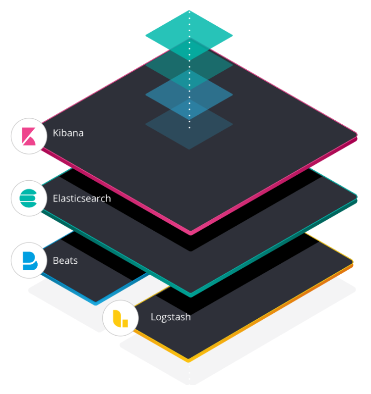
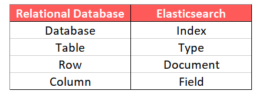
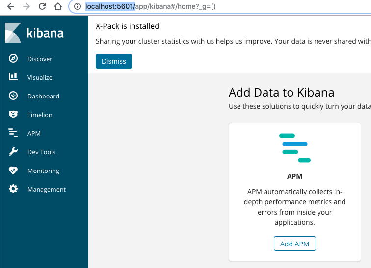
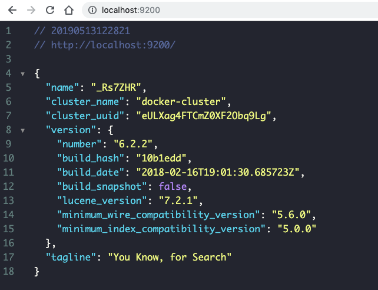
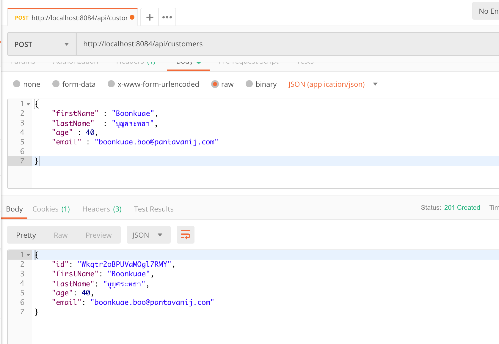
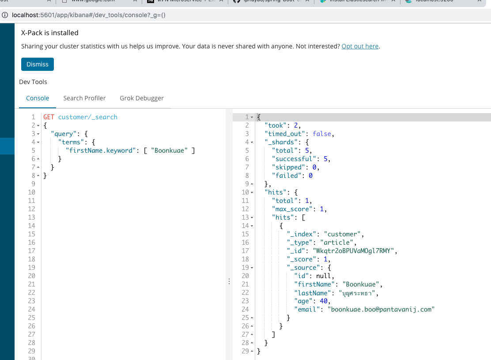

# spring-boot-elasticseach


## ELK stack




## Compare Database vs Elasticsearch



We use docker-compose to create ELK instance. Below a few command are step of 
up the instance. 

### Open a terminal and go to the project directory. use `cd documents` command to locate to the docker-compose.yml file.

```
cd documents
```
### Run `docker-compose up -d` command
```
docker-compose up -d
```
Open your web browser `http://localhost:5601/`. 



Check a cluster name by `http://localhost:9200/`




### Test create document via postman tools



### Test search via Kibana Dev Tools

```
GET customer/_search
{
  "query": {
    "terms": {
      "firstName.keyword": [ "Boonkuae" ] 
    }
  }
}

```


